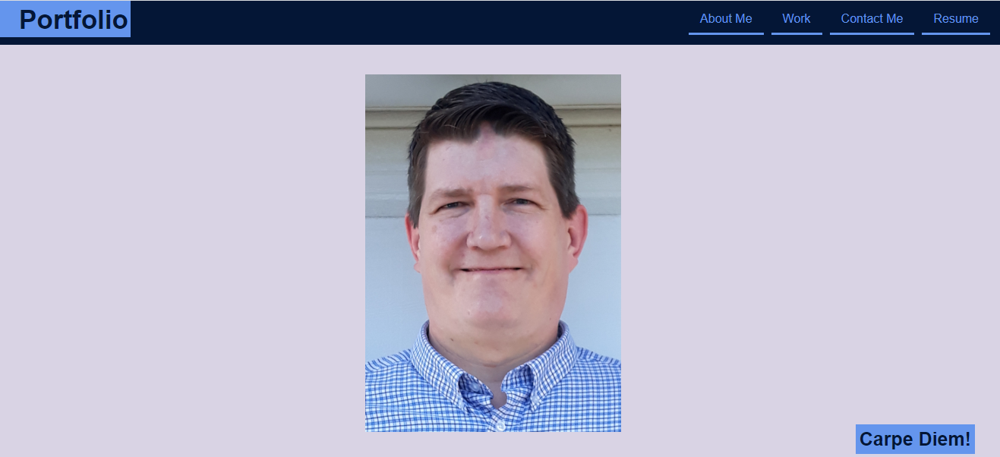
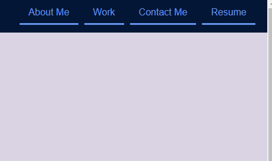
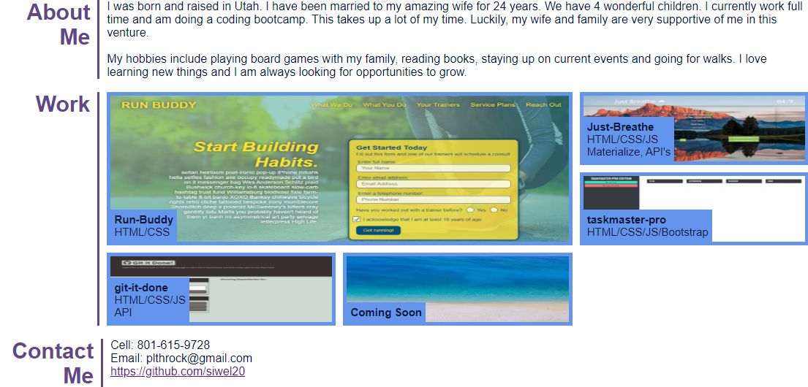

# Portfolio.

## Description
This is a web page that contains my professional portfolio so that others can get to know me and sample my work. 

## Motivation for development 
Given my desire to become a professional developer, this portfolio provides information about who I am and what my current skills are as a developer. 

## Features
* When users open the application the page displays portfolio information along with a current image of me. 

* The upper right hand corner of the Nav bar contains links to additional information about my work and who I am. 

* The lower section contains information about me and my work. In the work section you can click on the title of the project and you will be deployed to the active website for that project. 

## Built With
* HTML
* CSS

## Website and Github Location
* To visit the page go to: https://siwel20.github.io/portfolio/
* To visit the repository at Github go to: https://github.com/siwel20/portfolio

## Future Development
* Plans to add CSS library for improved responsiveness and aesthetics. 
* Improve overall color scheme.
* Add a family picture. 
